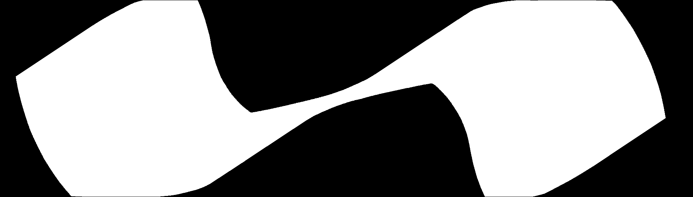

# The Moving Sofa Problem

移动沙发问题的介绍及当前进展见[The moving sofa problem — Dan Romik's home page](https://www.math.ucdavis.edu/~romik/movingsofa/)

## Numerical Results

单拐角

双拐角

紧邻双拐角

## TODO

考虑其他变种：

1. 利用一个车位改变车头方向
2. 连续转折路段
3. 圆弧型路
4. S型路

3维变种：

1. 直角弯的圆管
2. 螺旋楼梯
