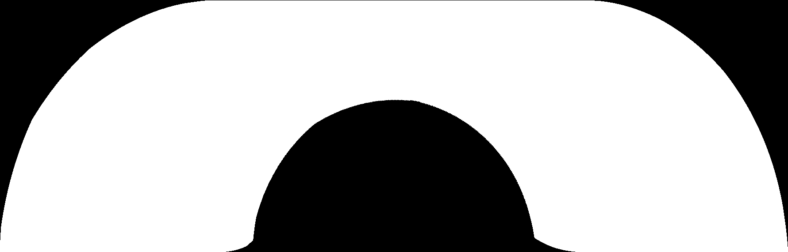
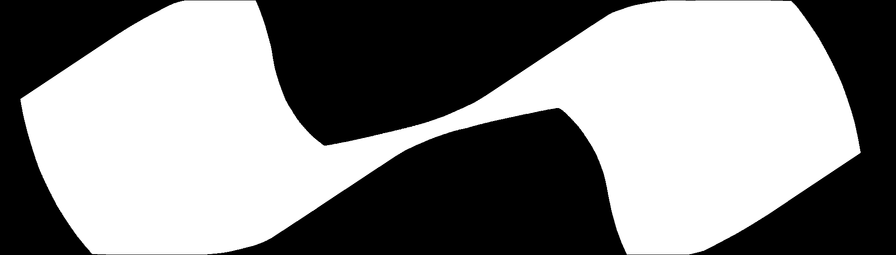

# The Moving Sofa Problem

移动沙发问题的介绍及当前进展见[The moving sofa problem — Dan Romik's home page](https://www.math.ucdavis.edu/~romik/movingsofa/)

## Numerical Results

单拐角



双拐角


紧邻双拐角



视频展示见[沙发的50万次进化](https://www.bilibili.com/video/BV1YwpXzGEiA/)。这个视频包含在一个合集中，在视频页面内点击即可查看各种类型沙发的演示。

给定一个固定形状的沙发（比如三角形），探讨能让它旋转一周的面积最小的房间是什么样也是有趣的问题。相关的可视化结果也包含在上述合集中，其中典型的一个是[房间的7万次进化](https://www.bilibili.com/video/BV1KABoBwEEg)。

## 如何使用

### 如何配置环境

推荐使用有独立显卡的计算机。

本项目只使用了很基础的 Python 包，如NumPy、SciPy、matplotlib、PIL、Taichi。我们推荐您直接安装Anaconda，它是免费软件，提供了 Python 环境和常用包。如果使用 Anaconda，安装好后您只需要打开Anaconda Prompt，键入

```bash
pip install taichi
```

按回车执行，顺利的话很快就能安装好Taichi，您会看到 Successful 之类的字眼。

您需要将本GitHub仓库克隆到本地，或者直接下载`.zip`文件然后解压在任何一个地方。使用 Visual Studio Code （一个免费的文本编辑器）打开项目文件夹。

### 如何计算自定义形状的走廊中能通过的最大面积的沙发

最基本的范例见`src\进化求解（单拐角）.ipynb`。您可以将它复制一份作为模板。您需要修改`is_forbidden`函数让它能正确反映你的走廊（即传入走廊内的坐标返回`False`，传入墙内的坐标返回`True`）。注意这是个被`ti.func`修饰的函数，它将运行在GPU上，所以语法有一定限制。您可以让AI帮您检查您的代码是否符合要求、是否是GPU友好的。

您需要修改`init_trajectory`函数的内容

您还需要修改`save_image_path`和`save_trajectory_path`的值，分别改成`'../images/name/sofa_'`和`'../trajectory/name/sofa_'`其中`name`替换成您为自己的自定义走廊起的名字。计算结果（包括演化过程）将会保存在这些目录中。

主要执行计算的是`run_optimization`这个函数，当您执行到该块时，可能需要数分钟完成计算。具体时间取决于您的硬件（独立显卡通常可以有效加速计算）以及轨道分辨率（即`len(xs)`）、`iterations`、`resolution`、`trajectory_upsampling`几个参数，近似正比于$resolution^n$其中$n$是维数（2或3），且正比于其他参数的1次方。

每执行一次包含`run_optimization`函数的那个块，`xs`、`ys`、`zs`（仅适用于3维情况）、`rotations`这几个变量会被替换，所以当您再次执行这个块，会在上一次的基础上进行。通常需要执行多次，并视情况人为增大细分或调整变异率等参数。当您想要细分轨迹使得控制点翻倍时，请注释掉

```python
xs,  # 上采样使得轨迹分辨率翻倍时注释掉这三行
ys,
rotations,
```

这几行，并取消注释

```python
initial_xs=zoom(xs, zoom=(2 * len(xs) - 1) / len(xs), order=1),  # 保持轨迹分辨率时注释掉这三行
initial_ys=zoom(ys, zoom=(2 * len(ys) - 1) / len(ys), order=1),
initial_rotations=zoom(rotations, zoom=(2 * len(rotations) - 1) / len(rotations), order=1),
```

这几行。对于3维情形，还分别包括关于Z的一行。

这个块下面还有一些可视化的块，它们不是必需的。

### 如何计算自定义形状的沙发旋转一周所需的最小房间

有趣的是，最小化房间和最大化沙发其实是同一个问题，只是沙发和墙壁的角色互换。

|                | 要最大化的形状 | 不变的形状 |
| -------------- | -------------- | ---------- |
| 最大化沙发问题 | 沙发           | 墙壁       |
| 最小化房间问题 | 墙壁           | 沙发       |

运动是相对的，沙发相对于墙壁的运动和墙壁相对于沙发的运动互为对方的逆，所以可以共用一套代码求解，只是可视化阶段不同。

您可以参考`src\进化求解（让三角形旋转一周的房间）.ipynb`修改出你自己的变种，使用方法和上一节几乎完全一样。

### 如何制作2D动画

制作2D动画非常简单，执行`src\制作动画_沙发进化.ipynb`（适用于最大化沙发问题）或`src\制作动画_房间进化.ipynb`（适用于最小化房间问题）就可以得到图像序列了。

### 如何制作3D动画

3D动画的制作较复杂，您需要掌握Blender的基本使用技巧。Blender是一款免费的3D建模、渲染软件。可以在官方下载页面[Download — Blender](https://www.blender.org/download/)下载。

使用`src/转化为网格.ipynb`可以将已保存在`trajectory/您自定义的名称/`中的`.npy`轨迹文件转化成网格（`.stl`文件）。这些网格会保存在`meshes/`目录下。

使用Blender打开`blender/`目录中的工程（您最需要的可能是`两个直角拐弯.blend`，它渲染沙发通过两个拐角的视频。下面以这个文件为例介绍），载入网格文件。

在`Script`页面中您能看到一些脚本。请先切换到名为“缩放、平移”的脚本，选中刚导入的网格（它通常非常巨大，这是因为在转化网格那一步，一个像素的尺寸被视为1），点▶。您将看到网格被缩放到了正确的大小。

现在请切换到名为“设置轨迹”的脚本。修改`np.load`函数中的路径为你实际存放轨迹`.npy`文件的绝对路径。修改`sofa_id = `后面的值为你现在正在操作的沙发的编号。然后点击▶。此时沙发已经被赋予了正确的运动轨迹，您可以拖动时间轴查看。

如果你的走廊是自定义的，您需要在Blender中构建出它的3D模型，以替换掉文档中默认的直角走廊。

点击3D视图右上角的显示模式切换按钮组中的“渲染”（对于Blender 5.0，总共有四个按钮，“渲染”是最右边的一个）。此时您应该能看到真实的渲染效果。调整材质和光照直到满意，然后就可以渲染图像序列。

### 如何将图像序列转化成视频

您需要使用另外的软件将图像序列转化为视频，很多软件（比如 Adobe After Effects）能做到这件事。

## TODO

考虑其他变种：

1. 利用一个车位改变车头方向
3. 圆弧型路
4. S型路

3维变种：

1. 直角弯的圆管
